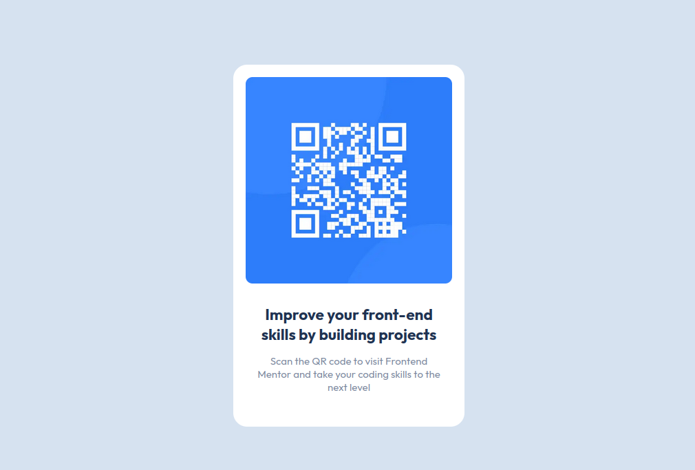

# Frontend Mentor - QR code component solution

This is a solution to the [QR code component challenge on Frontend Mentor](https://www.frontendmentor.io/challenges/qr-code-component-iux_sIO_H). Frontend Mentor challenges help you improve your coding skills by building realistic projects. 

## Table of contents

- [Overview](#overview)
  - [Screenshot](#screenshot)
  - [Links](#links)
- [My process](#my-process)
  - [Built with](#built-with)
  - [What I learned](#what-i-learned)
  - [Continued development](#continued-development)
  - [Useful resources](#useful-resources)
- [Author](#author)
- [Acknowledgments](#acknowledgments)

**Note: Delete this note and update the table of contents based on what sections you keep.**

## Overview

### Screenshot

### Links

- Solution URL: [GitHub Repository](https://github.com/jglopezre/qr-card-gatsby-component.git)
- Live Site URL: [Gatsby Cloud](https://qrcardgatsbycomponentmain.gatsbyjs.io/)

## My process

### Built with

- [Gatsbyjs](https://www.gatsbyjs.com/) - A Framework based on React form making static web pages

### What I learned

I was practicing to configure and starting a new project, and React component programing making embedded styles using JavasCript into the component

### Continued development

I want to improve skills using React and Gatsby framework on front end.

### Useful resources

- [Gatsby Basic Tutorial](https://www.gatsbyjs.com/docs/tutorial/) - This help me about basic configuration
- [W3school](https://www.w3schools.com/) - This site has information about CSS, HTML, Javascript and other stuffs.

## Author

- Website - [javierlo.site](http://javierlo.site)
- Frontend Mentor - [@@jglopezre](https://www.frontendmentor.io/profile/jglopezre)

## Acknowledgments

Just Continously practice will become you to a Master